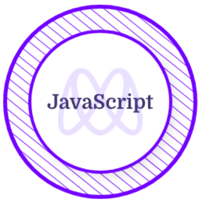

# Hi there! 👋 

## I'm a Full-Stack Developer 😄😄

- 🌱 I’m currently learning Ruby x Ruby on Rails.
- 👯 I’m looking to collaborate with other software developers.
- 🥅 2023 Goals: Learn more about web3 and contribute to open source.
- ⚡ Fun fact: I love playing football and the guitar 😻 

### Connect with me:

&nbsp;&nbsp;

&nbsp;&nbsp;

### Languages and Tools:

 
 

### MY GITHUB STATISTICS &nbsp; 

### Certificates and Licenses

&nbsp; &nbsp; &nbsp; &nbsp; 
&nbsp;&nbsp;&nbsp;&nbsp;&nbsp;&nbsp;&nbsp;&nbsp;&nbsp;&nbsp;&nbsp;&nbsp;

[twitter]: https://twitter.com/PeterDeTitan
[linkedin]: https://linkedin.com/in/peterokorafor

